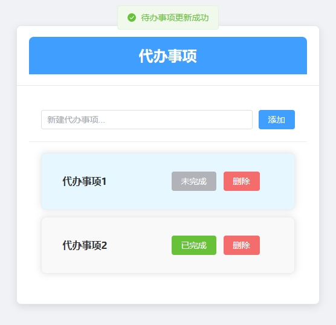

# TodoList
全栈todolist

首先在IDEA中运行Todoapp,打开后端
然后在Webstorm或vscode中打开todo-front ，使用 npm run dev 来启动前端

参考链接
https://www.bilibili.com/video/BV1LH4y1w7Nd?p=6&spm_id_from=pageDriver&vd_source=b5a1fffdf8e1ea0d15028b7f7449011d

